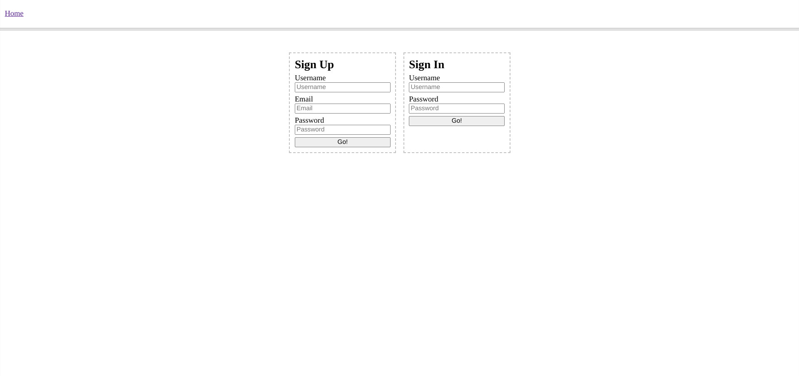
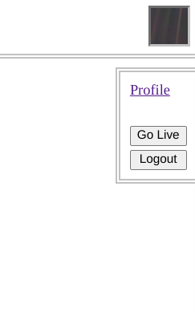
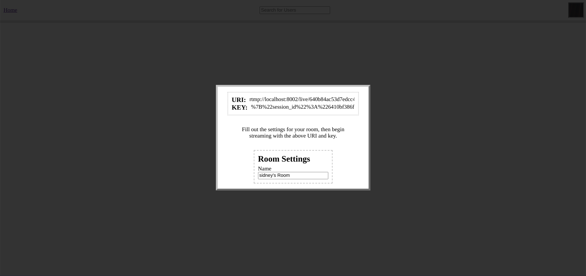
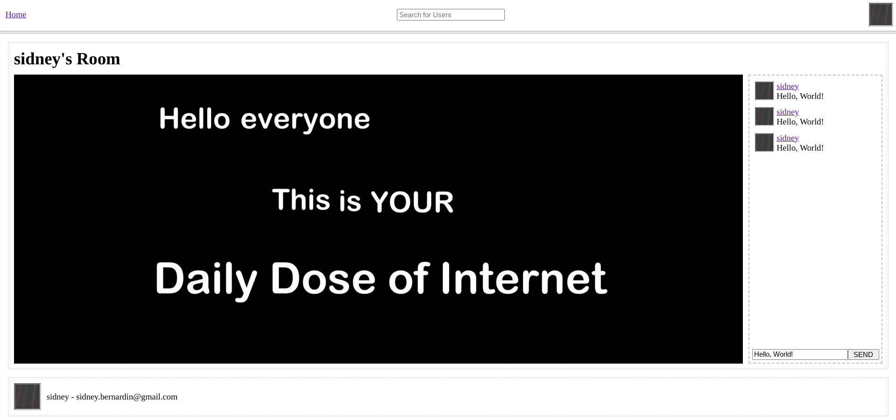

# Go-Live

**Contents**
1. [Overview](#overview)
1. [Usage](#usage)

## Overview
Go Live is an [HLS](https://en.wikipedia.org/wiki/HTTP_Live_Streaming) based live-streaming service. After creating an account, users can stream video from [OBS](https://obsproject.com/) (or another preferred streaming software) to Go Live's HLS server. The server will broadcast the stream to anyone who joins its room through the Go Live web-app. Other cool features include:

* Text chat for every room.
* Users being able to set thier own profile pictures.
* Rewindable streams up to 5 minutes behind.
* Text searching users.

For more on how this project works, visit my [portfolio](https://sidney-bernardin.github.io/project/?id=go_live).

## Usage

### Running Locally
Running Go Live locally on your machine is as simple as cloning this repository.

``` bash
git clone https://github.com/Sidney-Bernardin/Go-Live.git
cd Go-Live
```

Then using docker to spin-up Go Live's various services.

``` bash
# The "--profile web_app" spins-up an isolated/volume-less version of the web_app service's container.
docker compose --profile web_app up --build
```

### Using the Web-App
When you first open the web-app, you'll be greeted with a login page.
<div align=center>
  
</div>

After creating an account, you can live stream by clicking your profile button, then the Go Live button.
<div align=center>
  
</div>

A popup will appear and after naming your room, you'll be given a URI and key to use in OBS (or your prefered streaming software).
<div align=center>
  
</div>

Finally, you and other users can visit your profile to join the stream.
<div align=center>
  
</div>
