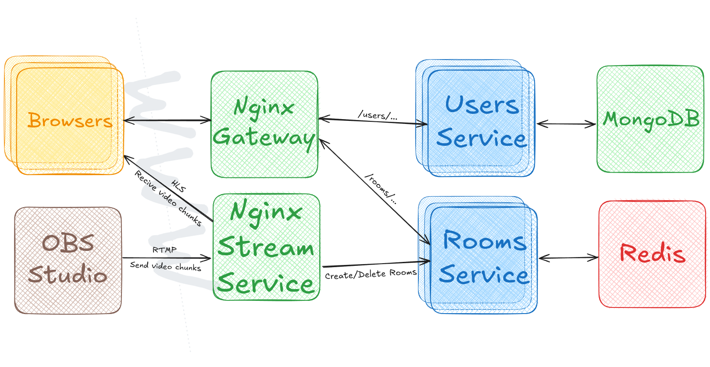
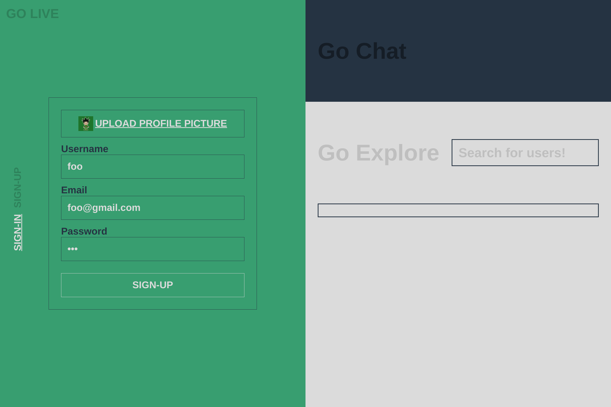
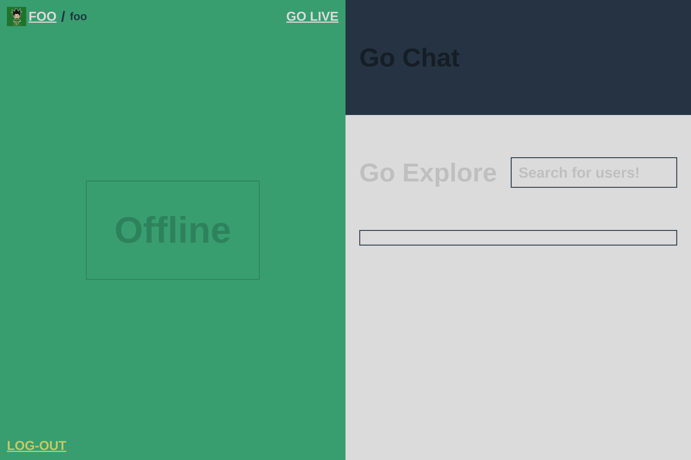
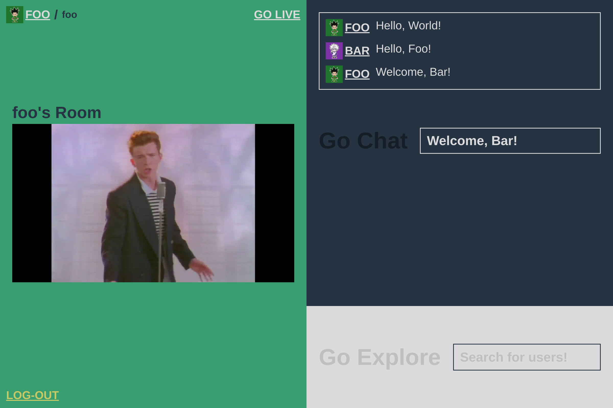

# Go-Live


**Contents**
1. [Overview](#overview)
1. [Usage](#usage)

## Overview
<div>
  
</div>

Go Live is an [RTMP](https://en.wikipedia.org/wiki/Real-Time_Messaging_Protocol)/[HLS](https://en.wikipedia.org/wiki/HTTP_Live_Streaming) based live-streaming application. After creating an account, users can stream live video from [OBS](https://obsproject.com/) (or another preferred streaming software) to Go Live's [RTMP](https://en.wikipedia.org/wiki/Real-Time_Messaging_Protocol)/[HLS](https://en.wikipedia.org/wiki/HTTP_Live_Streaming) server. The server will broadcast the stream to anyone who joins its room through the Go Live web-app. Other cool features include:

* Text chat for every room.
* Users with profile pictures.
* Rewindable streams up to 5 minutes behind.
* Regex based user search.

For more on how this project works, visit my [portfolio](https://sidney-bernardin.github.io).

## Usage

### Install and run Go-Live's various services.

1) Clone this repository.
``` bash
git clone https://github.com/Sidney-Bernardin/Go-Live.git
cd Go-Live
```

2) Set a registry name with the following environment variable.
``` env
REGISTRY=<whatever you want>
```

3) Run services with Docker Compose. In dev mode, NPM is required because a volume will be used for Vite's HMR feature.
``` bash
docker compose up --build
```

### Using the web-app
When you first open the web-app, you'll be greeted with a login page.
<div>
  
</div>

After creating an account you can start streaming. Click the GO_LIVE button to put your RTMP URL into your clipboard.
<div>
  
</div>

To create your room all you have to do is start streaming with [OBS](https://obsproject.com/). Or you can use FFMPEG to stream a video file with the following command.
``` bash
ffmpeg -re -i "rick.mp4" -c:v copy -c:a aac -ar 44100 -ac 1 -f flv your_rtmp_url
```
<div>
  
</div>
